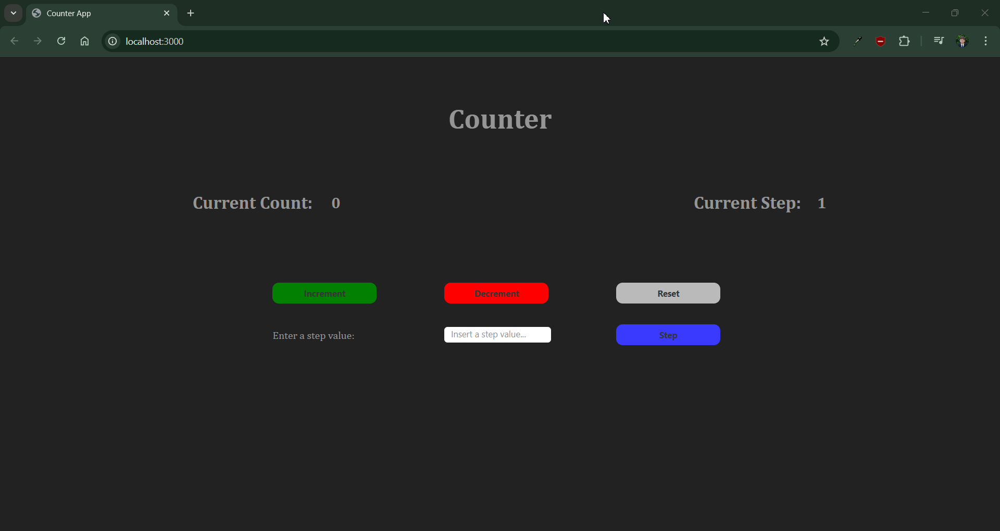

<div align="right">
    <a href="#portuguese-section" title="Interact with this button to view README in portuguese">Português</a>
</div>

# Counter App

A sleek, interactive counter application built with **TypeScript**, **HTML**, and **CSS**. This project demonstrates clean DOM manipulation, state management, and CSS animations.

## Features

- **Core Counting**: Increment and decrement the total count.
- **Custom Steps**: Define a specific "step" value to change how much the counter moves per click.
- **Input Validation**: Prevents non-natural integers for step values.
- **Visual Feedback**: Smooth fade-in and fade-away error messages using CSS keyframe animations.
- **Responsive Reset**: Instantly clear state back to default values.

## Tech Stack

- **Logic**: TypeScript (compiled to ES2020)
- **Styling**: Modern CSS3 with Grid and Flexbox
- **Runtime**: Node.js & npm
- **Development**: TypeScript Compiler (`tsc`)

## Brief Demonstration



## Getting Started

### Prerequisites
Ensure you have Node.js installed on your machine.

### Installation
1. Clone the repository or download the source code.
2. Open your terminal in the project directory.
3. Install the development dependencies:
   ```bash
   npm install
   ```

### Running the App
This project requires active compilation of TypeScript files.

1. **Start the Compiler**: Open two terminal windows and keep them open simultaneously. Now with one terminal window, run the following command in a terminal to watch for changes and auto-build the `dist/` folder:
   ```bash
   npm run watch
   ```
2. **Launch the Server**: In a second terminal window, start the local development server:
   ```bash
   npm run start
   ```
3. Open your browser to the URL provided in the terminal (usually `http://localhost:3000`).

## License

This repository is assigned to the MIT license.

---
<details id="portuguese-section">
 <summary>Ver versão em português (clique aqui para expandir)</summary>

 <a name="versão em português"></a>

 # Aplicativo Contador

 Um aplicativo contador elegante e interativo desenvolvido com **TypeScript**, **HTML** e **CSS**. Este projeto demonstra manipulação de DOM de forma clara, gerenciamento de estado e animações CSS.
 
 ## Recursos
 
 - **Contagem Básica**: Incrementa e decrementa a contagem total.
 - **Passos Personalizados**: Define um valor específico de “passo” para alterar o quanto o contador avança a cada clique.
 - **Validação de entrada**: Impede valores inteiros não naturais para os passos.
 - **Feedback visual**: Mensagens de erro com fade-in e fade-out suaves usando animações de keyframe em CSS.
 - **Redefinição responsiva**: Limpa instantaneamente o estado, retornando aos valores padrão.
 
 ## Pilha de tecnologias
 
 - **Lógica**: TypeScript (compilado para ES2020)
 - **Estilo**: CSS3 moderno com Grid e Flexbox
 - **Runtime**: Node.js e npm
 - **Desenvolvimento**: Compilador TypeScript (`tsc`)
 
 ## Breve demonstração
 
 
 
 ## Introdução
 
 ### Pré-requisitos
 Certifique-se de ter o Node.js instalado em sua máquina.
 
 ### Instalação
 1. Clone o repositório ou baixe o código-fonte.
 2. Abra seu terminal no diretório do projeto.
 3. Instale as dependências de desenvolvimento:
    ```bash
    npm install
    ```
 
 ### Executando o aplicativo
 Este projeto requer a compilação ativa de arquivos TypeScript.
 
 1. **Inicie o compilador**: Abra duas janelas de terminal e mantenha-as abertas simultaneamente. Agora, em uma das janelas de terminal, execute o seguinte comando para monitorar alterações e compilar automaticamente a pasta `dist/`:
    ```bash
    npm run watch
    ```
 2. **Inicie o servidor**: Em uma segunda janela de terminal, inicie o servidor de desenvolvimento local:
    ```bash
    npm run start
    ```
 3. Abra seu navegador na URL fornecida no terminal (geralmente `http://localhost:3000`).
 
 ## Licença
 
 Este repositório está sujeito à licença MIT.